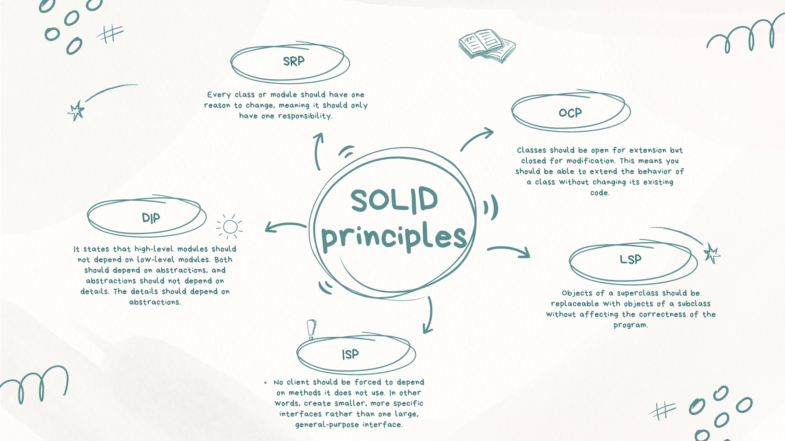

# SOLID-Principle

The SOLID principles are a set of five design principles in object-oriented programming that aim to create systems that are easy to maintain, understand, and extend. Here’s a breakdown:

1. S - Single Responsibility Principle (SRP)
1. O - Open/Closed Principle (OCP)
1. L - Liskov Substitution Principle (LSP)
1. I - Interface Segregation Principle (ISP)
1. D - Dependency Inversion Principle (DIP)

These principles promote more flexible, scalable, and maintainable code, making it easier to handle future changes and extensions
